```text
Nama: Wahyudi
NIM: 2241720018
Kelas: 3C
```

---

# Tugas Pemrograman Mobile Jobsheet 10

## Praktikum 1: Dart Streams

### Langkah 1: Menambahkan file main.dart

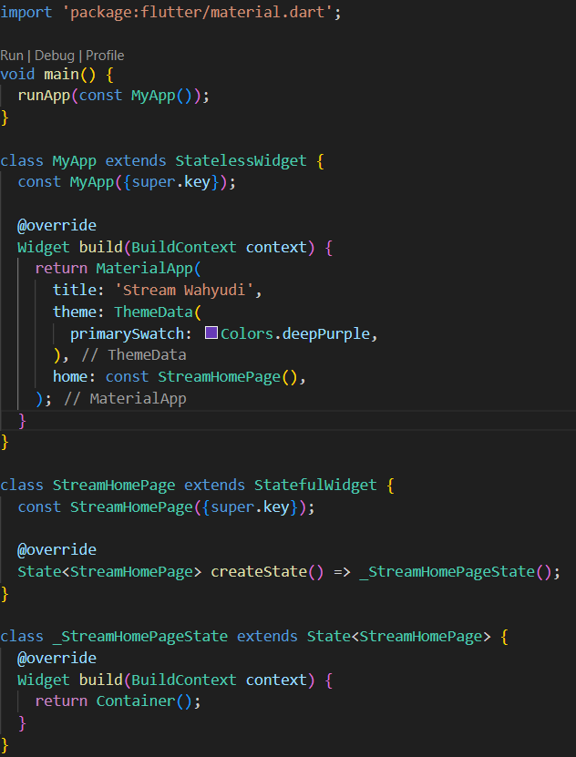

```text
Menambahkan nama sebagai identitas hasil pekerjaan telah selesai.
```

### Langkah 2: Menambahkan file stream.dart

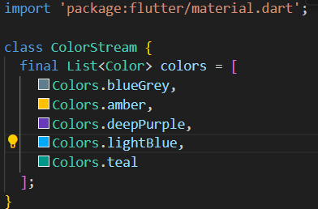

```text
Menambahkan 5 warna telah selesai.
```

### Langkah 3: Menambahkan method getColors()

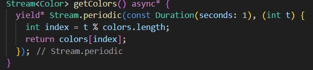

#### Jelaskan fungsi keyword yield* pada kode tersebut

```text
yield* meneruskan elemen dari stream lain secara langsung ke stream yang dihasilkan oleh method getColors().
```

#### Apa maksud isi perintah kode tersebut?

```text
Method getColors() menghasilkan warna dari daftar colors setiap 1 detik secara berulang menggunakan Stream.periodic.
```

### Langkah 4: Mengedit class _StreamHomePageState di main.dart

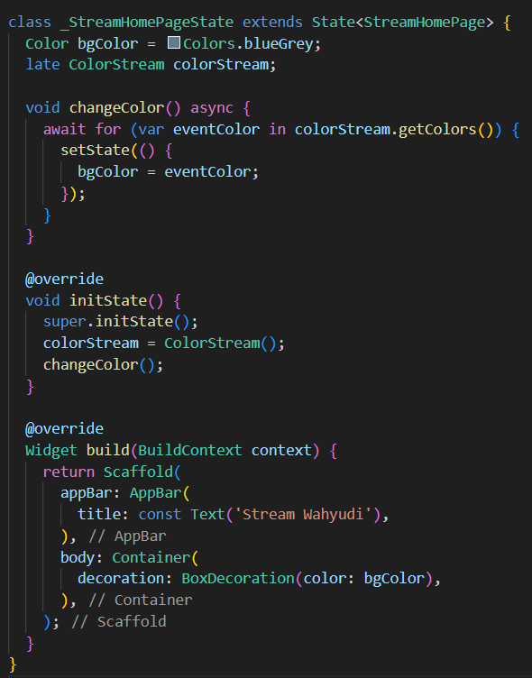


```text
Mengedit class _StreamHomePageState di main.dart telah selesai.
```

### Langkah 5: Mengganti isi method changeColor() class _StreamHomePageState di main.dart

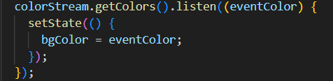

#### Jelaskan perbedaan menggunakan listen dan await for

```text
await for menunggu tiap item stream secara berurutan, sedangkan listen langsung menangani tiap item saat diterima tanpa menunggu.
```

## Praktikum 2: Stream controllers dan sinks

### Langkah 1: Menambahkan class NumberStream di stream.dart

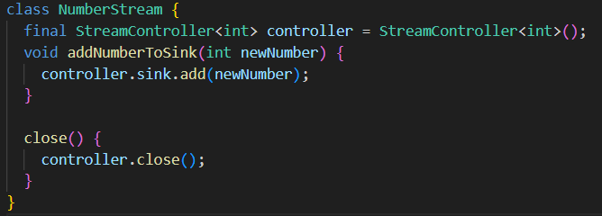

```text
Menambahkan class NumberStream di stream.dart telah selesai.
```

### Langkah 2: Mengedit class _StreamHomePageState di main.dart

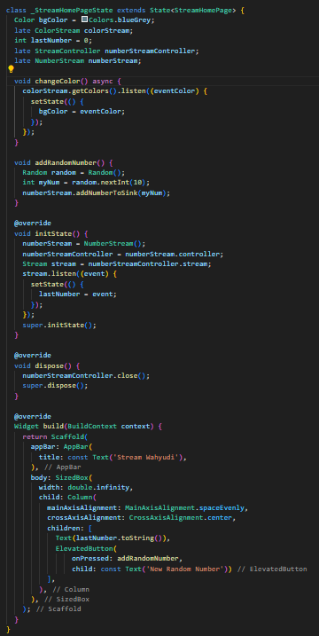

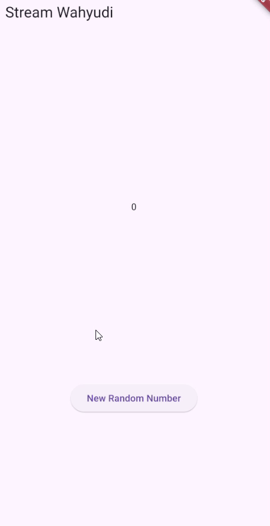

#### Jelaskan maksud kode edit initState() dan tambah method addRandomNumber() tersebut!

```text
- initState(): Menginisialisasi objek NumberStream dan mendengarkan stream-nya untuk memperbarui lastNumber setiap kali ada data baru yang ditambahkan.

- addRandomNumber(): Menambahkan angka acak dari 0 hingga 9 ke dalam stream melalui metode addNumberToSink.
```

### Langkah 3: Menambahkan error handling pada class NumberStream di stream.dart

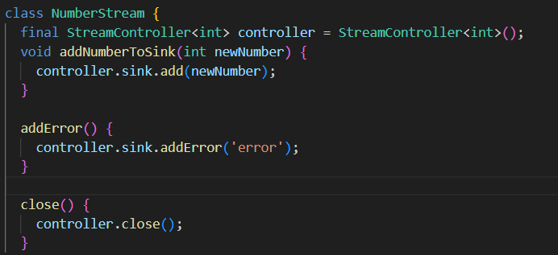

```text
Menambahkan error handling pada class NumberStream di stream.dart telah selesai.
```

### Langkah 4: Mengedit method addRandomNumber() dan initState() pada class StreamHomePageState di main.dart

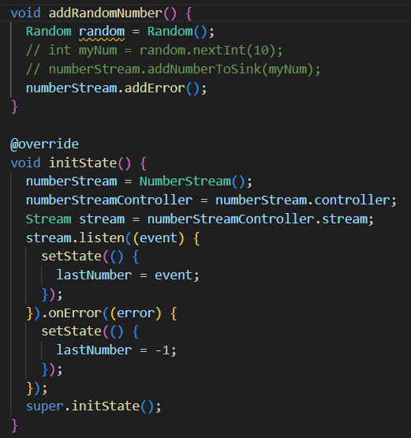

```text
Mengedit method addRandomNumber() dan initState() pada class StreamHomePageState di main.dart telah selesai.
```

#### Jelaskan maksud kode langkah 3 sampai 4 tersebut!

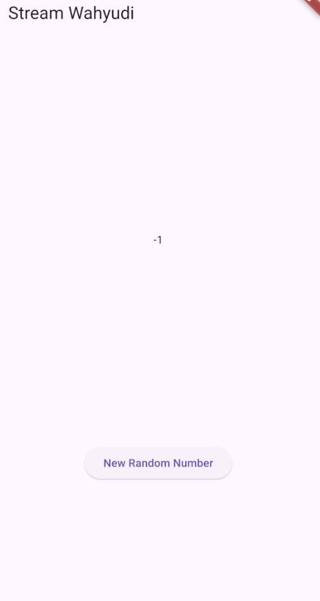

```text
- Langkah 3: Menambahkan metode addError() di NumberStream untuk mengirimkan error ke stream.
- Langkah 4: Menggunakan onError() pada listener stream untuk menangani error dan mengubah nilai lastNumber menjadi -1 saat error dan Mengubah addRandomNumber() untuk memanggil addError() dan mengirimkan error ke stream.
```

## Praktikum 3: Injeksi data ke streams

### Langkah 1: Mengedit initState() pada class StreamHomePageState di main.dart

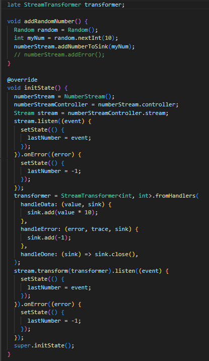

#### Jelaskan maksud kode langkah 1 tersebut!

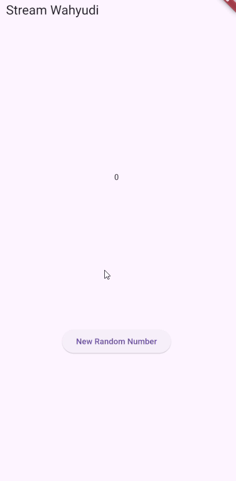

```text
Kode  mengelola stream untuk menghasilkan dan mentransformasi angka acak, memodifikasi nilai angka dengan mengalikannya 10 kali, serta menampilkan angka terakhir yang dihasilkan, sambil menangani kesalahan dengan menampilkan nilai -1 jika terjadi error, dan menutup stream controller saat widget dihapus.
```

## Praktikum 4: Subscribe ke stream events

### Langkah 1: Mengedit class StreamHomePageState di main.dart

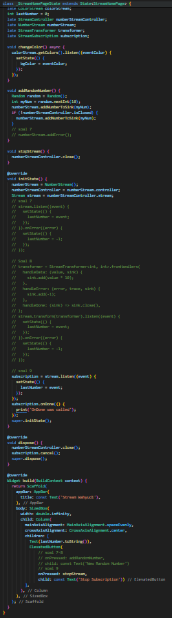

#### Jelaskan maksud kode langkah 1 tersebut!

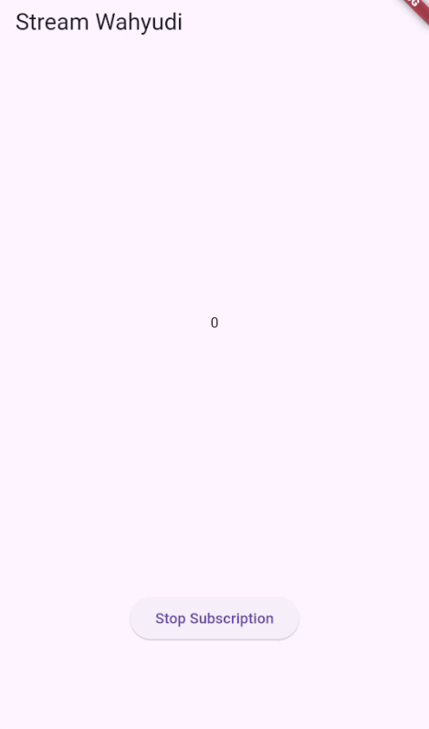

```text
- Kode subscription = stream.listen((event) {...}): Mendengarkan aliran data (stream) dari numberStreamController dan memperbarui nilai lastNumber pada tampilan setiap kali ada data baru yang diterima.  

- Kode subscription.cancel(): Menghentikan langganan (subscription) stream agar tidak menerima data baru dan membebaskan sumber daya terkait.  

- Kode void addRandomNumber() {...}: Menghasilkan angka acak dan mengirimkannya ke stream melalui numberStream.addNumberToSink(myNum), dengan pengecekan untuk memastikan stream belum ditutup sebelum menambahkan angka baru.  
```

## Praktikum 5: Multiple stream subscriptions

### Langkah 1: Mengedit initState() pada class StreamHomePageState di main.dart

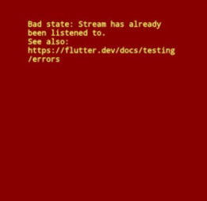

#### Jelaskan mengapa error itu bisa terjadi ?

```text
Error terjadi karena sebuah stream hanya dapat memiliki satu listener, sementara dalam kode tersebut terdapat dua subscription (subscription dan subscription2) yang mencoba mendengarkan stream yang sama.
```

### Langkah 2: Mengedit initState() dan build() pada class StreamHomePageState di main.dart

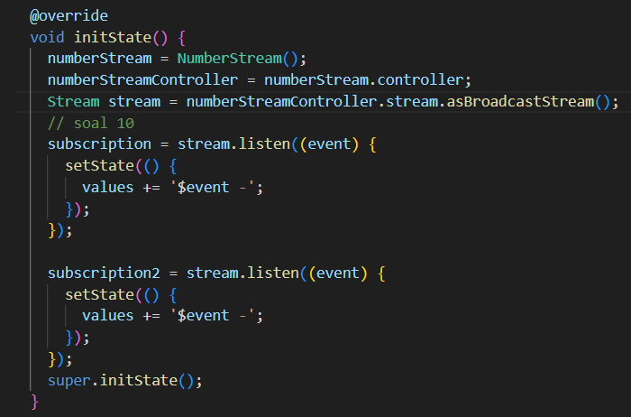

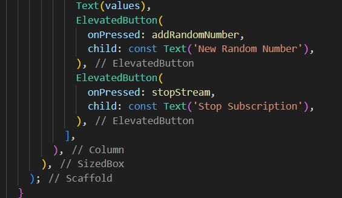

#### Jelaskan mengapa hal itu bisa terjadi ?

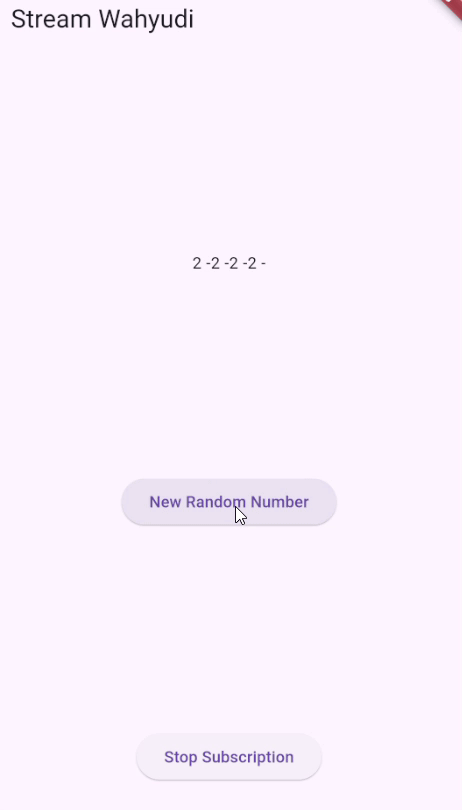

```text
Angka yang bertambah dua kali terjadi karena ada dua subscription yang mendengarkan stream yang sama, sehingga setiap kali angka baru ditambahkan, kedua subscription tersebut memperbarui UI secara bersamaan.
```

## Praktikum 6: StreamBuilder

### Langkah 1: Menambahkan class NumberStream di stream.dart

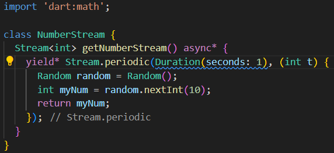

```text
Menambahkan class NumberStream di stream.dart telah selesai.
```

### Langkah 2: Menambahkan class StreamHomePageState di main.dart


```text
Menambahkan class StreamHomePageState di main.dart telah selesai.
```

#### Jelaskan maksud kode pada langkah 1 dan 2!


```text
- Class NumberStream menghasilkan stream angka acak setiap detik menggunakan Stream.periodic, yang menghasilkan angka acak antara 0 hingga 9.

- Method build pada StreamHomePage membangun tampilan yang menampilkan angka acak yang diterima dari stream menggunakan StreamBuilder, dengan menampilkan angka atau pesan error berdasarkan status stream.
```

## Praktikum 7: BLoC Pattern

### Langkah 1: Menambahkan class RandomNumberBloc di random_bloc.dart

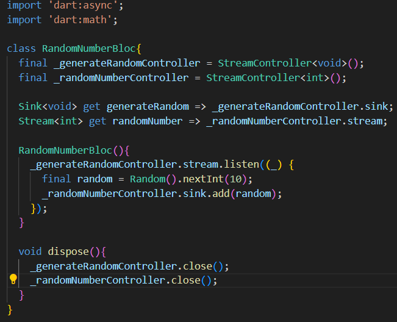

```text
Menambahkan class RandomNumberBloc di random_bloc.dart telah selesai.
```

### Langkah 2: Menambahkan class RandomScreenState di random_screen.dart

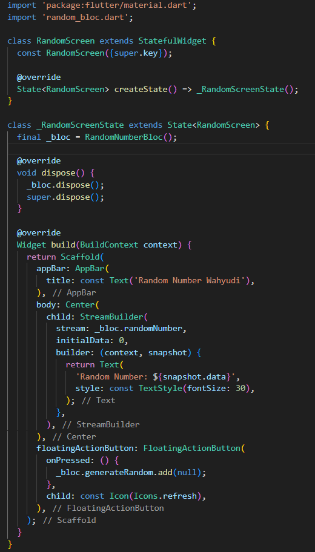

```text
Menambahkan class RandomScreenState di random_screen.dart telah selesai.
```

### Langkah 3: Menambahkan class RandomScreen() di main.dart

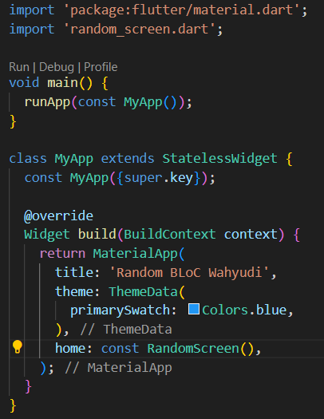

```text
Menambahkan class RandomScreen() di main.dart telah selesai.
```

#### Jelaskan maksud praktikum ini ! Dimanakah letak konsep pola BLoC-nya ?

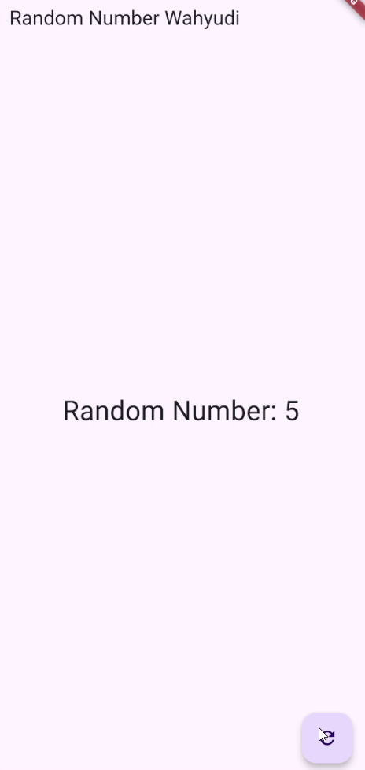

```text
Praktikum ini bertujuan untuk memahami pola BLoC (Business Logic Component) dalam memisahkan logika bisnis dari antarmuka pengguna di Flutter menggunakan Stream dan StreamController. Pada implementasinya, logika untuk menghasilkan angka acak dikelola oleh RandomNumberBloc, di mana perintah untuk menghasilkan angka baru dikirim melalui Sink (generateRandom), dan hasilnya dialirkan ke UI melalui Stream (randomNumber). UI menggunakan StreamBuilder untuk mendengarkan perubahan data secara reaktif dan menampilkan angka acak tersebut, sementara interaksi pengguna dengan tombol hanya mengirimkan event ke BLoC. Dengan pola ini, logika bisnis dan UI dipisahkan, sehingga aplikasi lebih terstruktur dan mudah dikelola.
```
