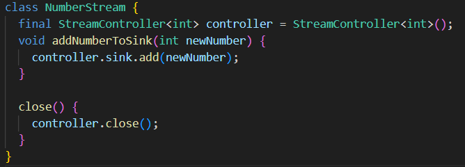
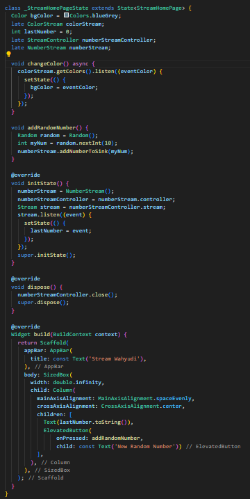
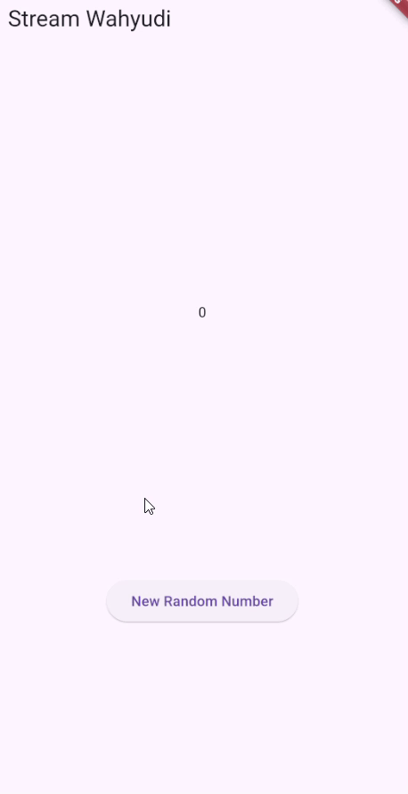
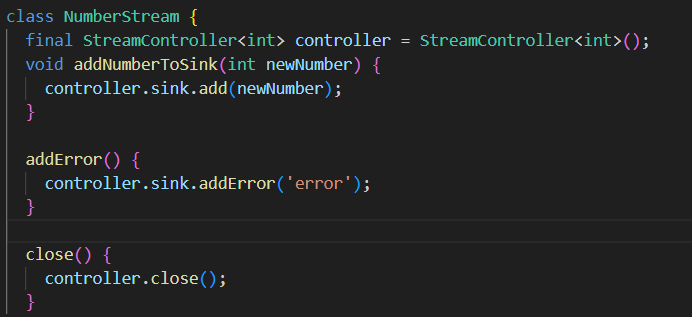
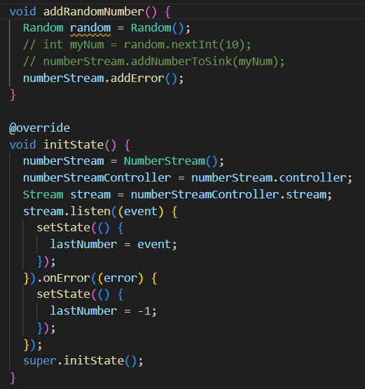
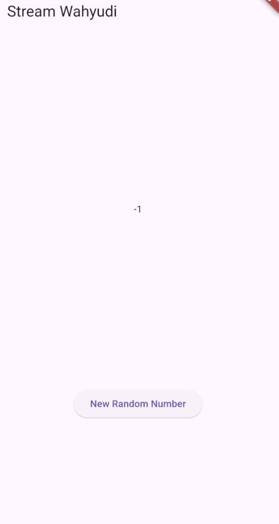
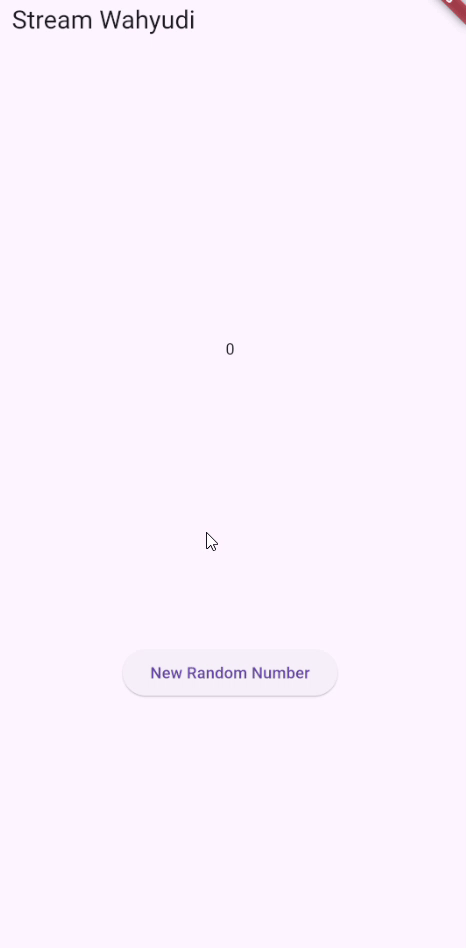
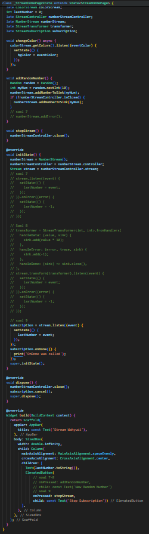
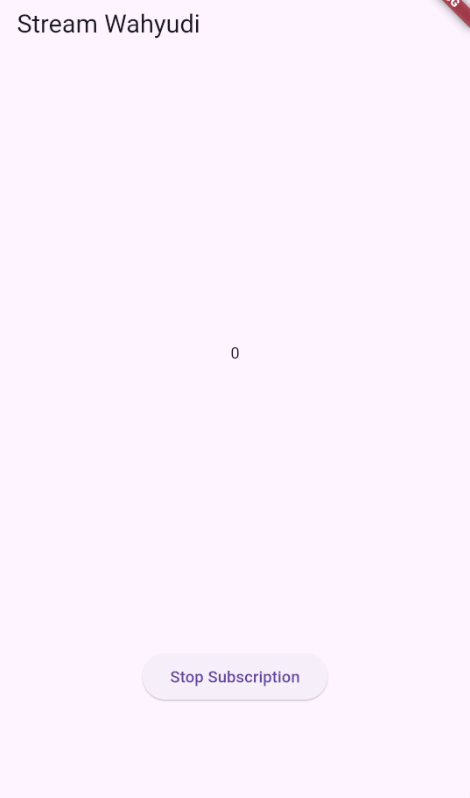

```text
Nama: Wahyudi
NIM: 2241720018
Kelas: 3C
```

---

# Tugas Pemrograman Mobile Jobsheet 10

## Praktikum 1: Dart Streams

### Langkah 1: Menambahkan file main.dart


```text
Menambahkan nama sebagai identitas hasil pekerjaan telah selesai.
```

### Langkah 2: Menambahkan file stream.dart


```text
Menambahkan 5 warna telah selesai.
```

### Langkah 3: Menambahkan method getColors()


#### Jelaskan fungsi keyword yield* pada kode tersebut

```text
yield* meneruskan elemen dari stream lain secara langsung ke stream yang dihasilkan oleh method getColors().
```

#### Apa maksud isi perintah kode tersebut?

```text
Method getColors() menghasilkan warna dari daftar colors setiap 1 detik secara berulang menggunakan Stream.periodic.
```

### Langkah 4: Mengedit class _StreamHomePageState di main.dart


```text
Mengedit class _StreamHomePageState di main.dart telah selesai.
```

### Langkah 5: Mengganti isi method changeColor() class _StreamHomePageState di main.dart


#### Jelaskan perbedaan menggunakan listen dan await for

```text
await for menunggu tiap item stream secara berurutan, sedangkan listen langsung menangani tiap item saat diterima tanpa menunggu.
```

## Praktikum 2: Stream controllers dan sinks

### Langkah 1: Menambahkan class NumberStream di stream.dart



```text
Menambahkan class NumberStream di stream.dart telah selesai.
```

### Langkah 2: Mengedit class _StreamHomePageState di main.dart





#### Jelaskan maksud kode edit initState() dan tambah method addRandomNumber() tersebut!

```text
- initState(): Menginisialisasi objek NumberStream dan mendengarkan stream-nya untuk memperbarui lastNumber setiap kali ada data baru yang ditambahkan.

- addRandomNumber(): Menambahkan angka acak dari 0 hingga 9 ke dalam stream melalui metode addNumberToSink.
```

### Langkah 3: Menambahkan error handling pada class NumberStream di stream.dart



```text
Menambahkan error handling pada class NumberStream di stream.dart telah selesai.
```

### Langkah 4: Mengedit method addRandomNumber() dan initState() pada class StreamHomePageState di main.dart



```text
Mengedit method addRandomNumber() dan initState() pada class StreamHomePageState di main.dart telah selesai.
```

#### Jelaskan maksud kode langkah 3 sampai 4 tersebut!



```text
- Langkah 3: Menambahkan metode addError() di NumberStream untuk mengirimkan error ke stream.
- Langkah 4: Menggunakan onError() pada listener stream untuk menangani error dan mengubah nilai lastNumber menjadi -1 saat error dan Mengubah addRandomNumber() untuk memanggil addError() dan mengirimkan error ke stream.
```

## Praktikum 3: Injeksi data ke streams

### Langkah 1: Mengedit initState() pada class StreamHomePageState di main.dart


#### Jelaskan maksud kode langkah 1 tersebut!



```text
Kode  mengelola stream untuk menghasilkan dan mentransformasi angka acak, memodifikasi nilai angka dengan mengalikannya 10 kali, serta menampilkan angka terakhir yang dihasilkan, sambil menangani kesalahan dengan menampilkan nilai -1 jika terjadi error, dan menutup stream controller saat widget dihapus.
```

## Praktikum 4: Subscribe ke stream events

### Langkah 1: Mengedit initState() pada class StreamHomePageState di main.dart



#### Jelaskan maksud kode langkah 1 tersebut!



```text
- Kode subscription = stream.listen((event) {...}): Mendengarkan aliran data (stream) dari numberStreamController dan memperbarui nilai lastNumber pada tampilan setiap kali ada data baru yang diterima.  

- Kode subscription.cancel(): Menghentikan langganan (subscription) stream agar tidak menerima data baru dan membebaskan sumber daya terkait.  

- Kode void addRandomNumber() {...}: Menghasilkan angka acak dan mengirimkannya ke stream melalui numberStream.addNumberToSink(myNum), dengan pengecekan untuk memastikan stream belum ditutup sebelum menambahkan angka baru.  
```
