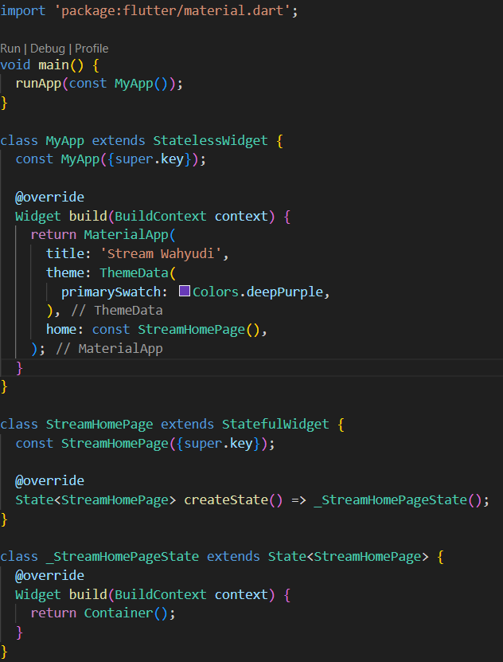
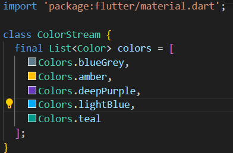

```text
Nama: Wahyudi
NIM: 2241720018
Kelas: 3C
```

---

# Tugas Pemrograman Mobile Jobsheet 10

## Praktikum 1: Dart Streams

### Langkah 1: Menambahkan file main.dart



```text
Menambahkan nama sebagai identitas hasil pekerjaan telah selesai.
```

### Langkah 2: Menambahkan file stream.dart



```text
Menambahkan 5 warna telah selesai.
```