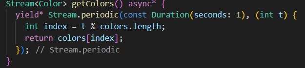

```text
Nama: Wahyudi
NIM: 2241720018
Kelas: 3C
```

---

# Tugas Pemrograman Mobile Jobsheet 10

## Praktikum 1: Dart Streams

### Langkah 1: Menambahkan file main.dart


```text
Menambahkan nama sebagai identitas hasil pekerjaan telah selesai.
```

### Langkah 2: Menambahkan file stream.dart


```text
Menambahkan 5 warna telah selesai.
```

### Langkah 3: Menambahkan method getColors()



#### Jelaskan fungsi keyword yield* pada kode tersebut!

```text
yield* meneruskan elemen dari stream lain secara langsung ke stream yang dihasilkan oleh method getColors().
```

#### Apa maksud isi perintah kode tersebut?

```text
Method getColors() menghasilkan warna dari daftar colors setiap 1 detik secara berulang menggunakan Stream.periodic.
```
