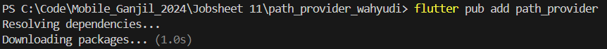
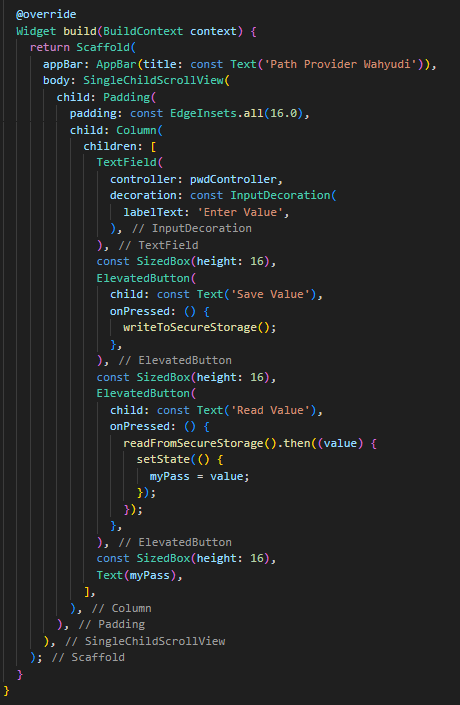

```text
Nama: Wahyudi
NIM: 2241720018
Kelas: 3C
```

---

# Tugas Pemrograman Mobile Jobsheet 11

## Praktikum 1: Converting Dart models into JSON

### Langkah 1: Menambahkan file main.dart


```text
Menambahkan kode awal untuk aplikasi  telah selesai.
```

### Langkah 2: Menambahkan file pizzalist.json


```text
Menambahkan file pizzalist.json telah selesai.
```

### Langkah 3: Menambahkan kode pada class _MyHomePageState di main.dart untuk menampilkan konten file JSON di layar


```text
Menampilkan konten file JSON di layar telah selesai.
```

### Langkah 4: Menambahkan file pizza.dart


```text
Menambahkan file pizza.dart telah selesai.
```

### Langkah 5: Menambahkan kode pada class _MyHomePageState di main.dart untuk menampilkan konten file JSON di layar


```text
Menampilkan konten file JSON di layar telah selesai.
```

## Praktikum 2:  Reading the JSON file

### Langkah 1: Menambahkan metode toJson() pada class Pizza di pizza.dart


```text
Menambahkan metode toJson() pada class Pizza di pizza.dart telah selesai.
```

### Langkah 2: Menambahkan metode convertToJson() pada class _MyHomePageState di main.dart untuk menampilkan String JSON


```text
Menampilkan String JSON telah selesai.
```

## Praktikum 3: Saving data simply with SharedPreferences

### Langkah 1: Menambahkan ketergantungan pada shared_preferences


```text
Menambahkan ketergantungan pada shared_preferences telah selesai.
```

### Langkah 2: Menambahkan metode readAndWritePreference() pada class _MyHomePageState di main.dart untuk menampilkan appCounter


```text
Menampilkan appCounter telah selesai.
```

### Langkah 2: Menambahkan metode deletePreference() pada class _MyHomePageState di main.dart untuk reset appCounter


```text
Tombol reset appCounter bisa digunakan.
```

## Praktikum 4: Accessing the filesystem, part 1: path_provider

### Langkah 1: Menambahkan metode getPaths() pada class _MyHomePageState di main.dart untuk mendapatkan path



```text
Menambahkan metode getPaths() pada class _MyHomePageState di main.dart telah selesai.
```

### Langkah 2: Menambahkan UI untuk menampilkan path yang sudah diambil


```text
Menampilkan path telah selesai.
```

## Praktikum 5: Accessing the filesystem, part 2: Working with directories

### Langkah 1: Menambahkan metode writeFile() dan readFile() pada class _MyHomePageState di main.dart untuk menulis dan membaca file


```text
Menambahkan metode writeFile() dan readFile() pada class _MyHomePageState di main.dart telah selesai.
```

### Langkah 2: Menambahkan UI untuk menampilkan isi file yang sudah diketik


```text
menampilkan isi file yang sudah ditulis telah selesai.
```

## Praktikum 6: Using secure storage to store data

### Langkah 1: Menambahkan ketergantungan pada flutter_secure_storage


```text
Menambahkan ketergantungan pada flutter_secure_storage telah selesai.
```

### Langkah 2: Menambahkan metode writeToSecureStorage() dan readFromSecureStorage() pada class _MyHomePageState di main.dart untuk menulis dan membaca teks


```text
enambahkan metode writeToSecureStorage() dan readFromSecureStorage() pada class _MyHomePageState di main.dart telah selesai.
```

### Langkah 2: Menambahkan UI untuk menampilkan isi file yang sudah diketik




```text
menampilkan isi file yang sudah ditulis telah selesai.
```
