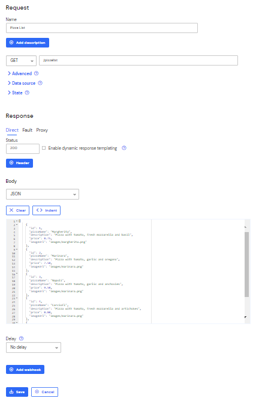
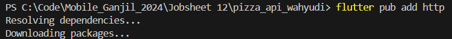
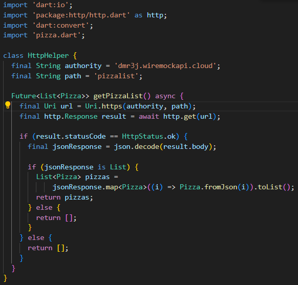
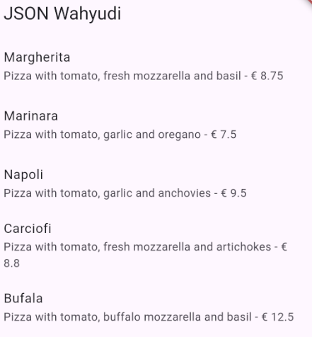
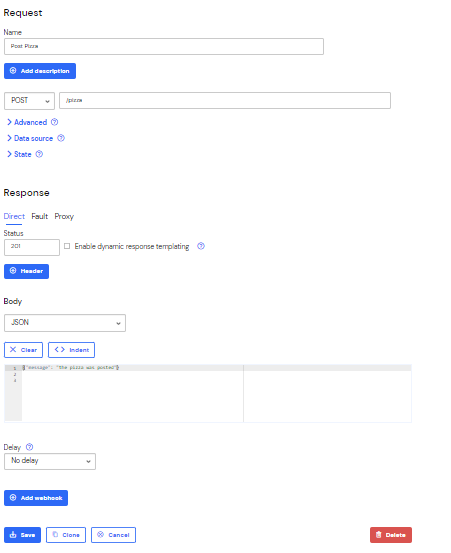
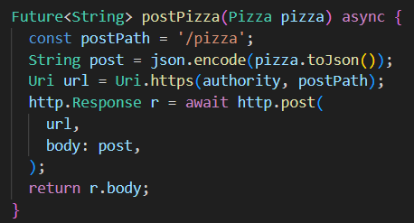
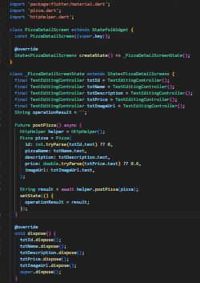
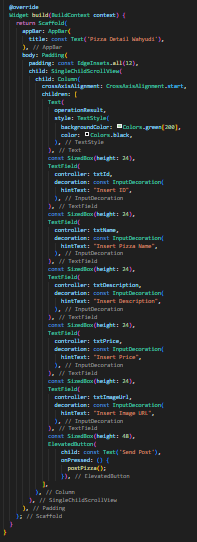
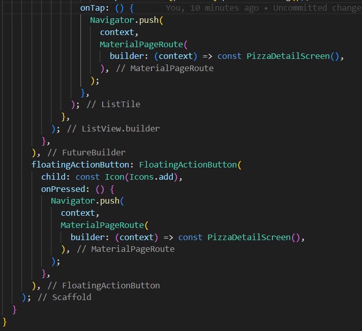
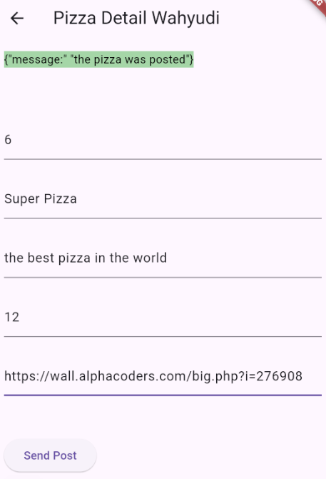

```text
Nama: Wahyudi
NIM: 2241720018
Kelas: 3C
```

---

# Tugas Pemrograman Mobile Jobsheet 12

## Praktikum 1: Designing an HTTP client and getting data

### Langkah 1: Membuat Mock baru



```text
Membuat Mock baru telah selesai.
```

### Langkah 2: Menambahkan pub http



```text
Menambahkan pub http telah selesai.
```

### Langkah 3: Menambahkan file httphelper.dart



```text
Menambahkan pub http telah selesai.
```

### Langkah 4: Menambahkan file main.dart untuk menampilkan data JSON




```text
Data JSON telah ditampilkan.
```

## Praktikum 2: POST-ing data

### Langkah 1: Membuat Mock baru



```text
Membuat Mock baru telah selesai.
```

### Langkah 2: Menambahkan metode postPizza() pada class HttpHelper di httpHelper.dart



```text
Menambahkan metode postPizza() pada class HttpHelper di httpHelper.dart telah selesai.
```

### Langkah 3: Menambahkan file pizza_detail.dart dengan class PizzaDetailScreen



```text
Menambahkan file pizza_detail.dart dengan class PizzaDetailScreen telah selesai.
```

### Langkah 4: Menambahkan UI untuk menampilkan detail pizza



```text
Detail pizza telah ditampilkan.
```

### Langkah 5: Menambahkan tombol aksi ke detail pizza pada class MyHomePageState di main.dart





```text
Isi detail pizza berhasil di post
```
