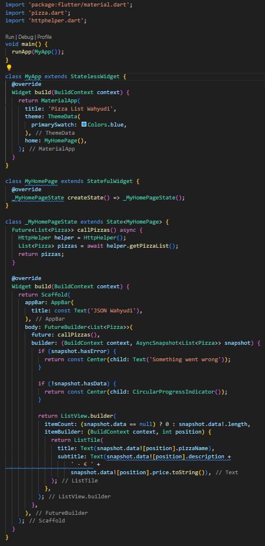
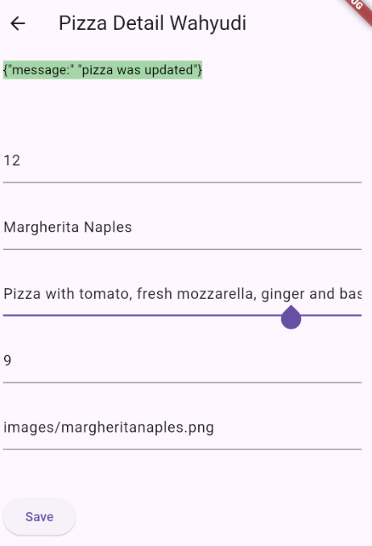
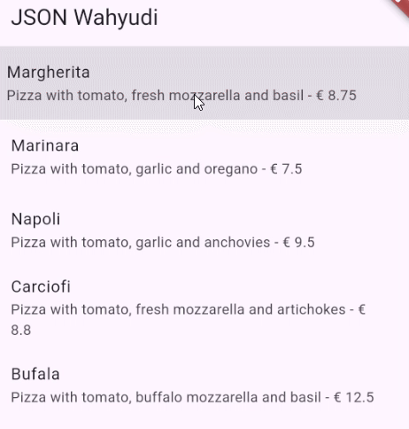

```text
Nama: Wahyudi
NIM: 2241720018
Kelas: 3C
```

---

# Tugas Pemrograman Mobile Jobsheet 12

## Praktikum 1: Designing an HTTP client and getting data

### Langkah 1: Membuat Mock baru


```text
Membuat Mock baru telah selesai.
```

### Langkah 2: Menambahkan pub http


```text
Menambahkan pub http telah selesai.
```

### Langkah 3: Menambahkan file httphelper.dart


```text
Menambahkan file httphelper.dart telah selesai.
```

### Langkah 4: Menambahkan file main.dart untuk menampilkan data JSON




```text
Data JSON telah ditampilkan.
```

## Praktikum 2: POST-ing data

### Langkah 1: Membuat Mock baru


```text
Membuat Mock baru telah selesai.
```

### Langkah 2: Menambahkan metode postPizza() pada class HttpHelper di httpHelper.dart


```text
Menambahkan metode postPizza() pada class HttpHelper di httpHelper.dart telah selesai.
```

### Langkah 3: Menambahkan file pizza_detail.dart dengan class PizzaDetailScreen


```text
Menambahkan file pizza_detail.dart dengan class PizzaDetailScreen telah selesai.
```

### Langkah 4: Menambahkan UI untuk menampilkan detail pizza


```text
Detail pizza telah ditampilkan.
```

### Langkah 5: Menambahkan tombol aksi ke detail pizza pada class _MyHomePageState di main.dart


```text
Tambah detail pizza berhasil di post
```

## Praktikum 3: PUT-ting data

### Langkah 1: Membuat Mock baru


```text
Membuat Mock baru telah selesai.
```

### Langkah 2: Menambahkan metode putPizza() pada class HttpHelper di httpHelper.dart


```text
Menambahkan metode putPizza() pada class HttpHelper di httpHelper.dart telah selesai.
```

### Langkah 3: Menambahkan metode savePizza() pada class PizzaDetailScreen di pizza_detail.dart


```text
Menambahkan metode savePizza() dan initState() pada class PizzaDetailScreen di pizza_detail.dart telah selesai.
```

### Langkah 4: Menambahkan properti onTap untuk update detail pizza ke listTitle pada class  _MyHomePageState di main.dart




```text
Update detail pizza telah berhasil.
```

## Praktikum 4: DELETE-ing data

### Langkah 1: Membuat Mock baru


```text
Membuat Mock baru telah selesai.
```

### Langkah 2: Menambahkan metode deletePizza() pada class HttpHelper di httpHelper.dart


```text
Menambahkan metode deletePizza() pada class HttpHelper di httpHelper.dart telah selesai.
```

### Langkah 3: Menambahkan widget Dismissible untuk hapus pizza ke listTitle pada class  _MyHomePageState di main.dart




```text
Hapus pizza telah berhasil.
```
