``` text
Nama: Wahyudi  
NIM: 2241720018  
Kelas: 3C  
```

---

# Tugas Pemrograman Mobile Jobsheet 5

## Praktikum 1
**Membuat projek flutter dengan nama hello_world menggunakan cmd** 

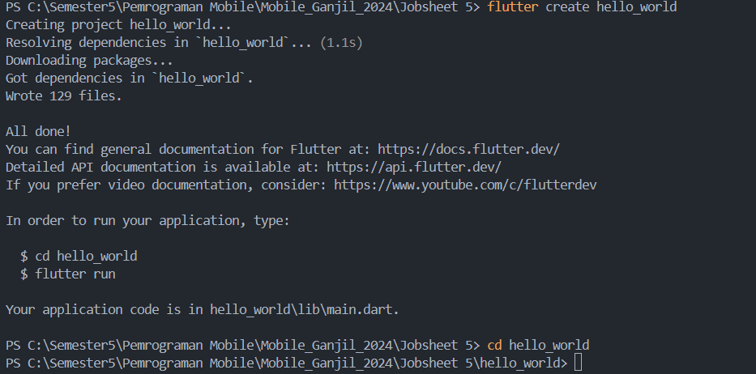
``` text
Pembuatan projek flutter baru telah selesai
```

## Praktikum 2
**Menghubungkan Perangkat Android Emulator** 

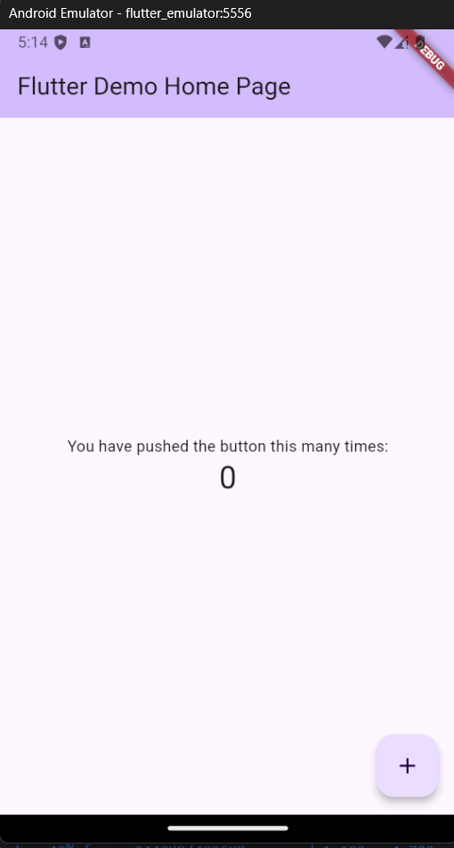
``` text
Android Emulator telah berhasil terhubung
```

## Praktikum 3
**Membuat Repository GitHub dan Laporan Praktikum** 

Langkah 1: Beri pesan commit "tambah gitignore" lalu klik Commit (✔)

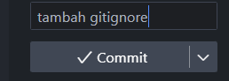

Langkah 2: Menambahkan teks yang ditampilkan dalam aplikasi berupa nama lengkap Anda.

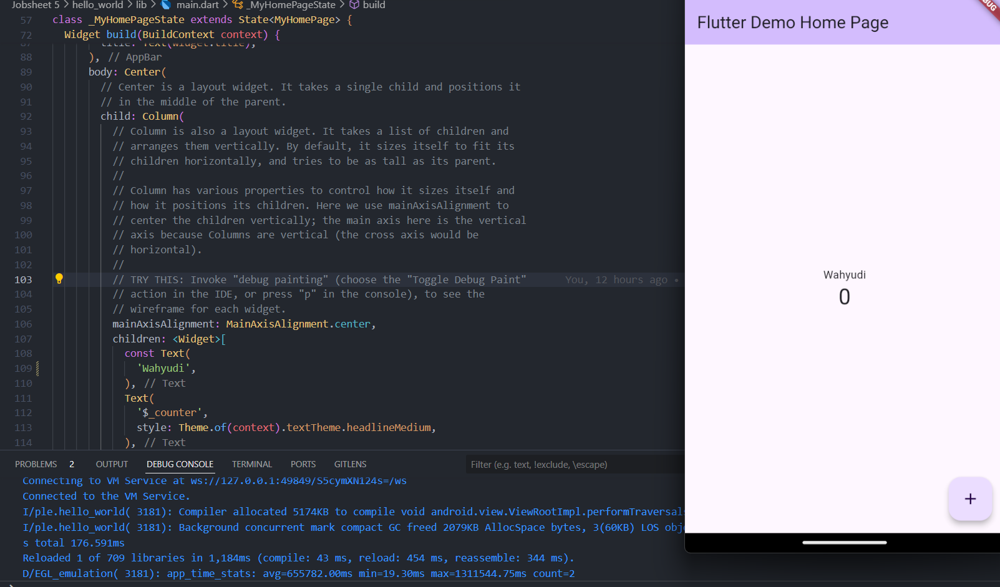
``` text
Aplikasi dengan teks berupa nama telah berhasil dibuat
```

## Praktikum 4
**Menerapkan Widget Dasar** 

Langkah 1: Menerapkan text widget

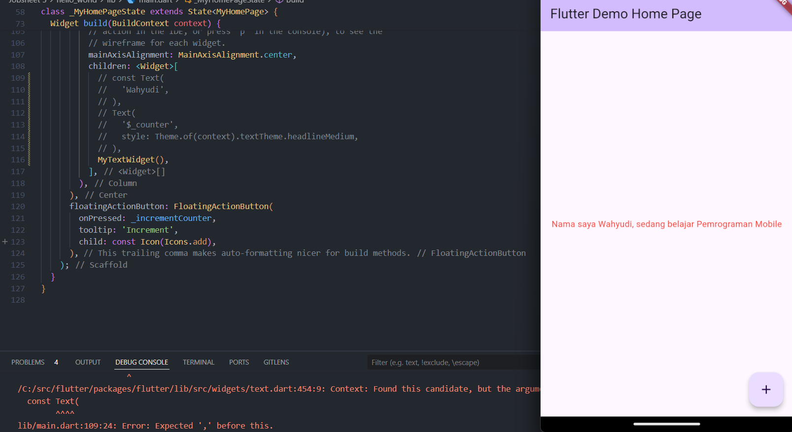
``` text
Aplikasi dengan widget berisi teks telah berhasil dibuat
```

Langkah 2: Menerapkan image widget

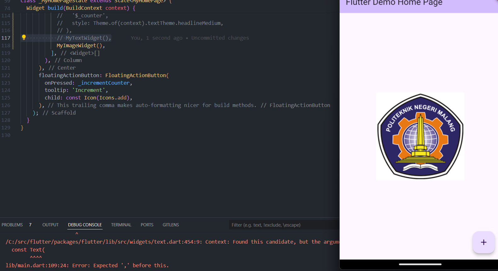
``` text
Aplikasi dengan widget berisi image telah berhasil dibuat
```

## Praktikum 5
**Menerapkan Widget Material Design dan iOS Cupertino** 

Langkah 1: Menerapkan Cupertino Button dan Loading Bar

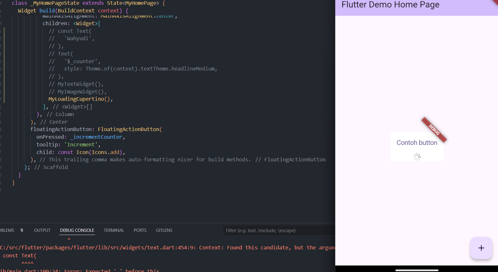
``` text
Aplikasi dengan widget berisi Cupertino Button dan Loading Bar telah berhasil dibuat
```

Langkah 2: Menerapkan Floating Action Button (FAB)

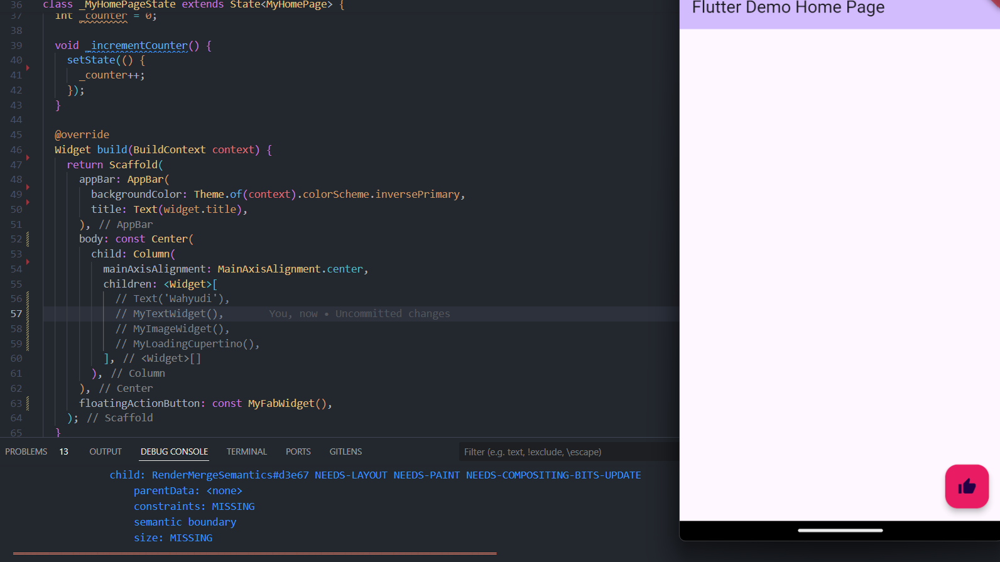
``` text
Aplikasi dengan widget berisi  Floating Action Button (FAB) telah berhasil dibuat
```

Langkah 3: Menerapkan Scaffold Widget

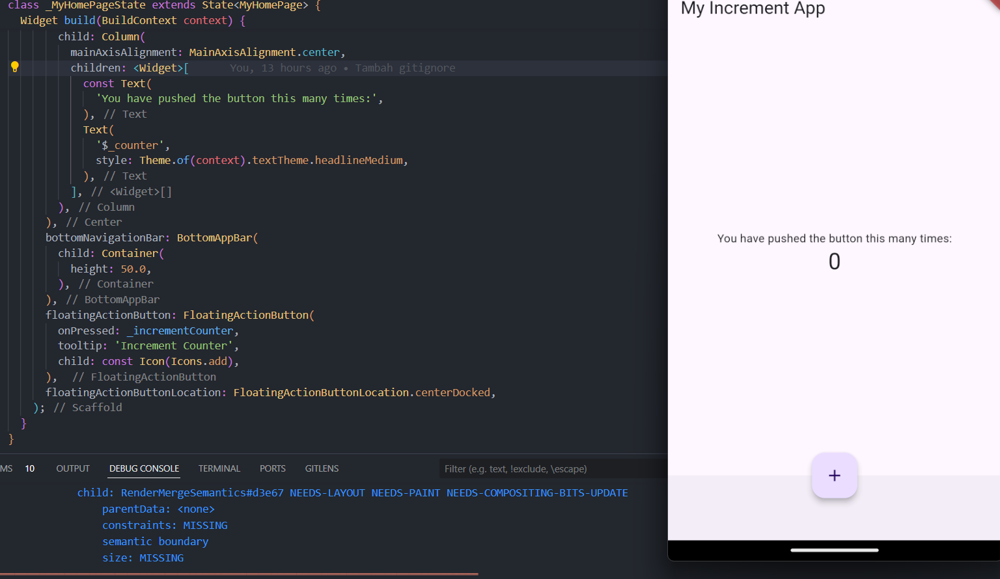
``` text
Aplikasi dengan Scaffold Widget telah berhasil dibuat
```

Langkah 4: Menerapkan Dialog Widget

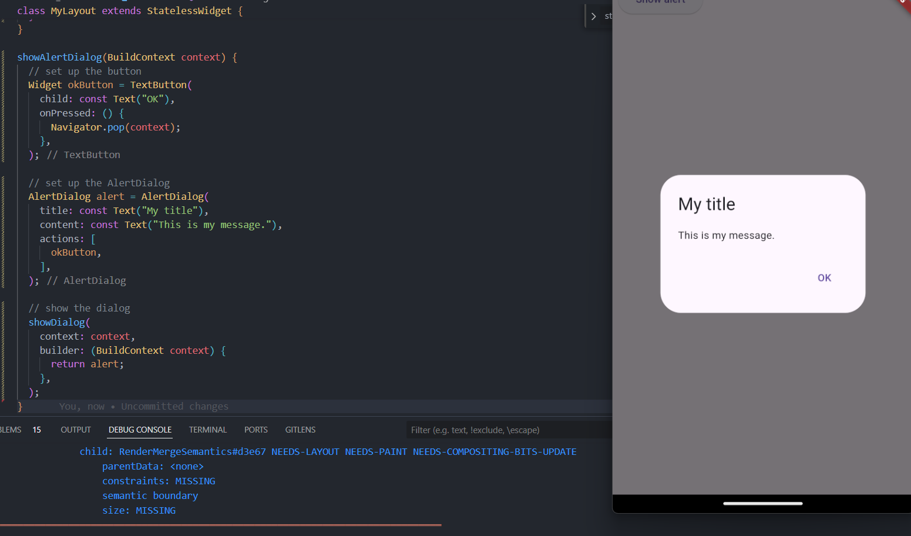
``` text
Aplikasi dengan Dialog Widget telah berhasil dibuat
```

Langkah 5: Menerapkan Input dan Selection Widget

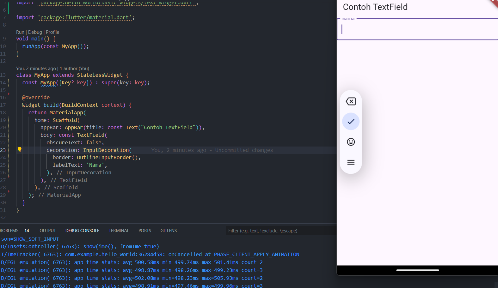
``` text
Aplikasi dengan Input dan Selection Widget telah berhasil dibuat
```

Langkah 6: Menerapkan Date and Time Pickers

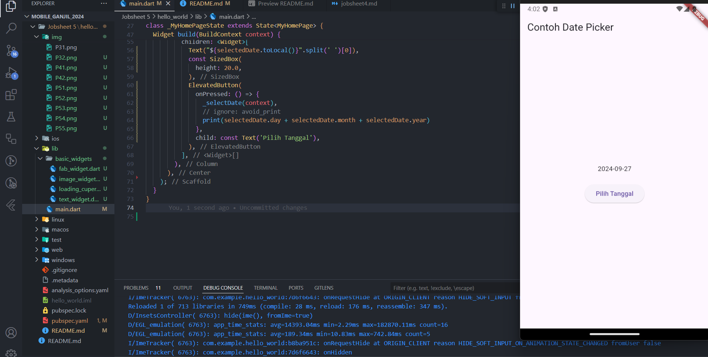
``` text
Aplikasi dengan Date and Time Pickers telah berhasil dibuat
```