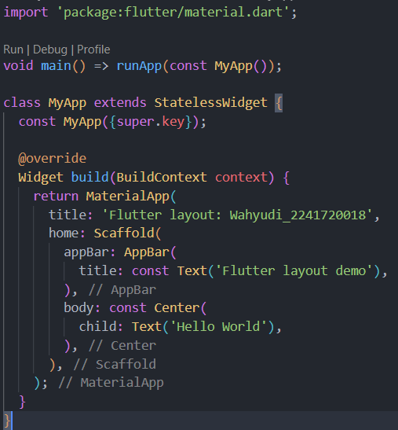
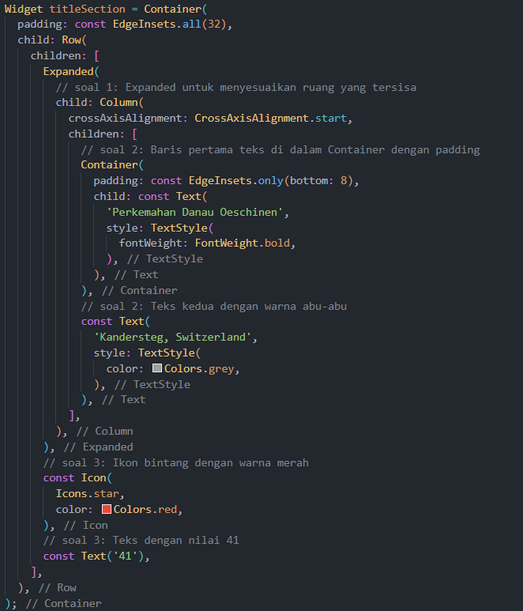
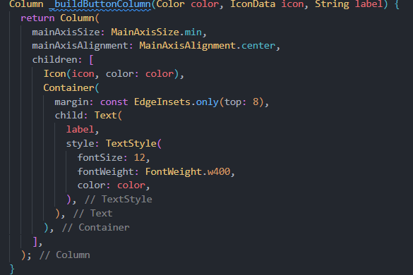
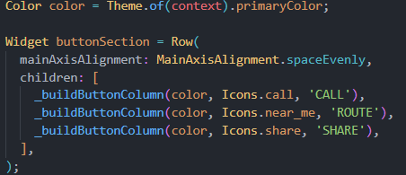
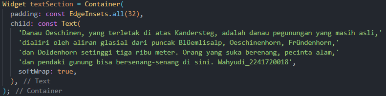
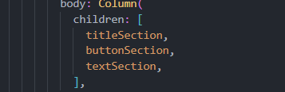
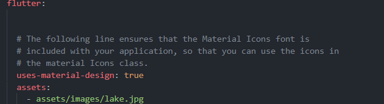
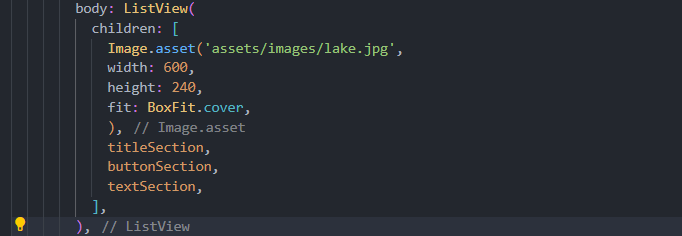

``` text
Nama: Wahyudi  
NIM: 2241720018  
Kelas: 3C  
```

---

# Tugas Pemrograman Mobile Jobsheet 6
## Praktikum 1:Membangun Layout di Flutter 
### Langkah 1: Mengisi nama dan NIM Anda di text title 


``` text
Pembuatan projek flutter baru telah selesai
```

### Langkah 2: Implementasi layout

``` text
Pembuatan layout telah selesai.
```

## Praktikum 2:Implementasi button row 
### Langkah 1: Buat method Column _buildButtonColumn

``` text
Pembuatan method Column _buildButtonColumn telah selesai
```

### Langkah 2: Buat widget buttonSection

``` text
Pembuatan widget buttonSection telah selesai
```

## Praktikum 3:Implementasi text section
### Langkah 1: Buat widget textSection

``` text
Pembuatan widget textSection telah selesai
```

### Langkah 2: Menambahkan variabel titleSection, buttonSection, dan textSection ke body 

``` text
Menambahkan variabel titleSection, buttonSection, dan textSection ke body telah selesai
```


## Praktikum 4:Implementasi image section
### Langkah 1: Menyiapkan aset gambar

``` text
Menyiapkan aset gambar telah selesai
```

### Langkah 2: Menambahkan gambar ke body dan Mengubah Column menjadi ListView

``` text
Menambahkan gambar ke body dan mengubah Column menjadi ListView telah selesai
```

## Hasil
