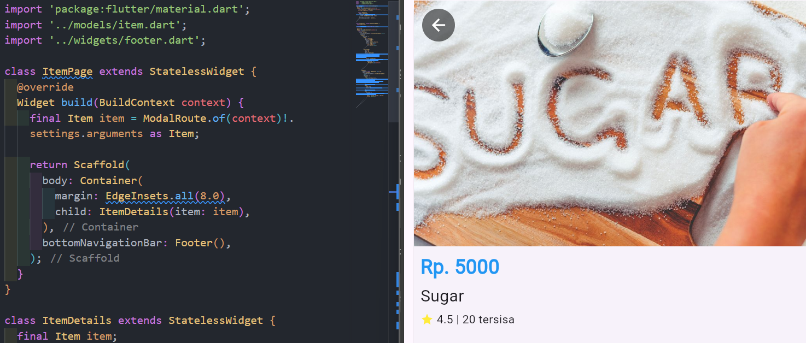

```text
Nama: Wahyudi
NIM: 2241720018
Kelas: 3C
```

---

# Tugas Pemrograman Mobile Jobsheet 6
## Praktikum 5:Membangun Navigasi di Flutter
### Langkah 1: Mendefinisikan Route

home_page.dart


item_page.dart


```text
Pembuatan route baru telah selesai
```

### Langkah 2: Lengkapi Kode di main.dart


```text
lengkapi kode di main.dart telah selesai
```

### Langkah 3: Membuat data model


```text
Pembuatan data model baru telah selesai
```

### Langkah 4: Lengkapi kode di class HomePage


```text
lengkapi kode di class HomePage telah selesai
```

### Langkah 5: Membuat ListView dan itemBuilder


```text
Pembuatan ListView dan itemBuilder baru telah selesai
```

### Langkah 6: Menambahkan aksi pada ListView


```text
Penambahan aksi pada ListView telah selesai
```

### Langkah 7: Mengubah tampilan menjadi GridView

home_page.dart


item_page.dart


```text
Mengubah tampilan menjadi GridView telah selesai
```

### Langkah 8: Implementasi Hero widget

home_page.dart


item_page.dart


```text
Implementasi Hero widget telah selesai
```

### Langkah 9: Modifikasi tampilan sehingga menjadi aplikasi yang menarik. Selain itu, pecah widget menjadi kode yang lebih kecil dan menambahkan footer

home_page.dart


item_page.dart


```text
Modifikasi tampilan sehingga menjadi aplikasi yang menarik. Selain itu, pecah widget menjadi kode yang lebih kecil dan menambahkan footer telah selesai
```