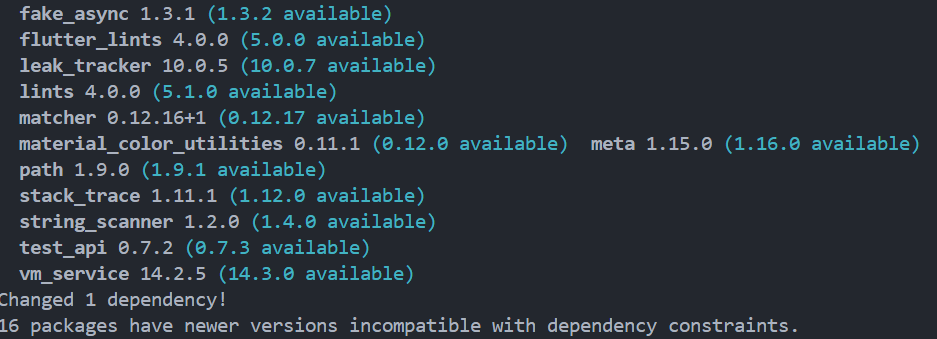

```text
Nama: Wahyudi
NIM: 2241720018
Kelas: 3C
```

---

# Tugas Pemrograman Mobile Jobsheet 7
## Praktikum 1:Membangun Navigasi di Flutter

### Langkah 1: Membuat Project Baru


```text
Membuat project baru dengan nama flutter_plugin_pubdev telah selesai.
```

### Langkah 2: Menambahkan Plugin


```text
Langkah 2 dalam praktikum ini menjelaskan cara menambahkan plugin `auto_size_text` ke proyek Flutter. Dengan menjalankan perintah `flutter pub add auto_size_text` di terminal, plugin ini akan diunduh dan otomatis ditambahkan ke file `pubspec.yaml` di bagian dependencies. Setelah berhasil, nama dan versi plugin akan terlihat di file tersebut, sehingga kita bisa langsung menggunakannya untuk membuat teks dalam aplikasi menyesuaikan ukuran secara otomatis.
```


### Langkah 3: Membuat File red_text_widget.dart


```text
Membuat file red_text_widget.dart telah selesai.
```

### Langkah 4: Menambah Widget AutoSizeText


```text
Menambah Widget AutoSizeText telah selesai.
```

### Langkah 5: Membuat Variabel text dan Parameter di Constructor


```text
Langkah 5 dalam praktikum ini menunjukkan cara membuat widget kustom bernama `RedTextWidget` dengan mendefinisikan variabel dan parameter di konstruktor. Di sini, kita menambahkan variabel `text` untuk menyimpan teks yang akan ditampilkan. Konstruktor `const RedTextWidget` kemudian dibuat untuk menerima parameter `text`, yang harus diisi saat membuat widget ini. Penambahan `Key? key` juga penting untuk membantu dalam pengelolaan dan identifikasi widget di dalam aplikasi, sehingga meningkatkan kinerja dan pengalaman pengguna.
```

### Langkah 6: Menambahkan Widget di main.dart


```text
Pada langkah 6, dua widget ditambahkan dalam file `main.dart`: `RedTextWidget` dan widget `Text`.

- RedTextWidget adalah widget kustom yang menampilkan teks dengan warna merah dan fitur penyesuaian ukuran otomatis menggunakan `AutoSizeText`. Widget ini dapat menampilkan teks dalam maksimal dua baris dan menggunakan titik ellipsis untuk menghindari teks yang terlalu panjang, sehingga memberikan tampilan yang lebih rapi dan menarik.

- Text adalah widget bawaan Flutter yang digunakan untuk menampilkan teks statis. Meskipun menampilkan teks yang sama, widget ini tidak memiliki kemampuan penyesuaian ukuran otomatis dan styling tambahan, sehingga tampilannya lebih sederhana.

Secara umum, `RedTextWidget` menawarkan lebih banyak fleksibilitas dan estetika dibandingkan widget `Text`, yang lebih dasar dan langsung.
```

### Hasil


## Tugas:Jelaskan maksud dari tiap parameter yang ada di dalam plugin auto_size_text berdasarkan tautan pada dokumentasi

```text
1. group: String

   Parameter group digunakan untuk mengelompokkan beberapa AutoSizeText yang memiliki grup yang sama. 
   Jika beberapa AutoSizeText berada dalam grup yang sama, maka ukuran font yang digunakan akan seragam. 
   Sebaliknya, jika AutoSizeText berada dalam grup yang berbeda, maka masing-masing akan memiliki ukuran font yang berbeda pula.

2. maxLines: int

   Parameter maxLines berfungsi untuk menetapkan batas maksimum jumlah baris yang dapat ditampilkan oleh AutoSizeText. 
   Jika teks melebihi jumlah baris yang ditentukan oleh maxLines, maka bagian teks yang melebihi akan ditampilkan sebagai overflow.

3. minFontSize: double

   Parameter minFontSize digunakan untuk menentukan ukuran font terkecil yang dapat ditampilkan oleh AutoSizeText. 
   Jika ukuran font di bawah minFontSize, maka ukuran font yang ditampilkan akan disesuaikan menjadi ukuran minimum yang ditentukan.

4. maxFontSize: double

   Parameter maxFontSize berfungsi untuk menetapkan batas maksimum ukuran font yang dapat ditampilkan. 
   Jika ukuran font melebihi maxFontSize, maka ukuran font yang ditampilkan akan dibatasi pada ukuran maksimum yang ditentukan.

5. presetFontSizes: List<double>

   Parameter presetFontSizes digunakan untuk mendefinisikan ukuran-ukuran font yang tersedia untuk ditampilkan oleh AutoSizeText. 
   Jika ukuran font melebihi daftar ukuran yang ada dalam presetFontSizes, maka akan terjadi overflow.

6. stepGranularity: double

   Parameter stepGranularity digunakan untuk menentukan penambahan ukuran font yang dapat diterapkan oleh AutoSizeText. 
   Jika ukuran font melampaui nilai stepGranularity, maka akan muncul overflow.

7. style: TextStyle

   Parameter style digunakan untuk mengatur gaya dari AutoSizeText. 
   Jika ada perbedaan gaya antara beberapa AutoSizeText, maka masing-masing akan menampilkan gaya yang berbeda.

8. strutStyle: StrutStyle

   Parameter strutStyle digunakan untuk menentukan gaya strut pada AutoSizeText. 
   Jika terdapat perbedaan dalam gaya strut, maka masing-masing AutoSizeText akan menampilkan gaya strut yang berbeda.

9. presetFontSizes: List<double>?

   Parameter presetFontSizes digunakan untuk menetapkan daftar ukuran font yang telah ditentukan sebelumnya untuk AutoSizeText. 
   Jika ukuran font yang digunakan oleh AutoSizeText melebihi ukuran yang ada dalam daftar presetFontSizes, maka akan terjadi overflow, di mana teks tidak dapat ditampilkan sesuai ukuran yang diinginkan.

10. locale: Locale

    Parameter locale digunakan untuk menentukan locale yang digunakan oleh AutoSizeText. 
    Jika AutoSizeText menggunakan locale yang berbeda, maka tampilan dan pengaturan teks akan disesuaikan dengan locale tersebut.

11. softWrap: bool

    Parameter softWrap berfungsi untuk menentukan apakah AutoSizeText dapat melakukan pemenggalan teks (wrap) atau tidak. 
    Jika softWrap diset ke true, maka teks akan melakukan pemenggalan saat mencapai batas lebar.

12. wrapWords: bool

    Parameter wrapWords digunakan untuk menentukan apakah pemenggalan teks dilakukan berdasarkan kata atau tidak. 
    Jika diset true, maka pemenggalan akan terjadi pada batas kata.

13. overflow: TextOverflow

    Parameter overflow digunakan untuk menentukan perilaku saat teks melampaui batas tampilan. 
    Jika ada perbedaan dalam pengaturan overflow, maka perilaku teks yang overflow juga akan berbeda.

14. overflowReplacement: Widget

    Parameter overflowReplacement digunakan untuk menentukan widget yang akan ditampilkan ketika terjadi overflow pada AutoSizeText. 
    Jika terjadi overflow, maka AutoSizeText akan menampilkan widget yang ditentukan oleh overflowReplacement.

15. textScaleFactor: double

    Parameter textScaleFactor digunakan untuk menentukan faktor skala dari teks yang ditampilkan. 
    Jika ada variasi dalam textScaleFactor, maka ukuran teks yang ditampilkan akan disesuaikan berdasarkan faktor skala tersebut.
```