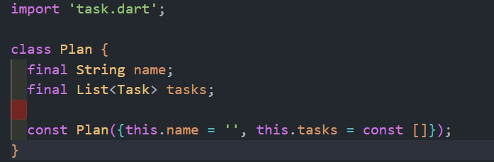
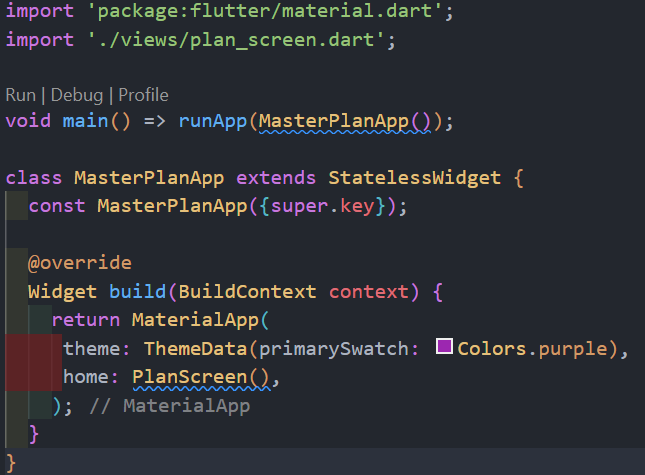
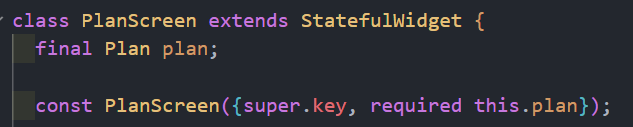
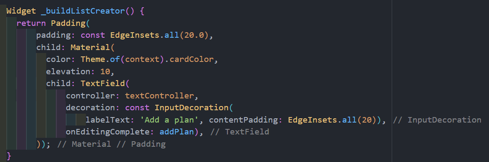

```text
Nama: Wahyudi
NIM: 2241720018
Kelas: 3C
```

---

# Tugas Pemrograman Mobile Jobsheet 8

## Praktikum 1:Dasar Manajemen State

### Langkah 1: Membuat Project Baru


```text
Membuat project baru dengan nama master_plan telah selesai.
```

### Langkah 2: Membuat model task.dart


```text
Membuat model task.dart telah selesai.
```

### Langkah 3: Membuat file plan.dart



```text
Membuat file plan.dart telah selesai.
```

### Langkah 4: Membuat file data_layer.dart


```text
Membuat file plan.dart telah selesai.
```

### Langkah 5: Mengubah file main.dart



```text
Mengubah file plan.dart telah selesai.
```

### Langkah 6: Membuat plan_screen.dart


```text
Membuat file plan_screen.dart telah selesai.
```

### Langkah 7: Membuat method _buildAddTaskButton()


```text
Membuat method _buildAddTaskButton() telah selesai.
```

### Langkah 8: Membuat buat widget _buildList()


```text
Membuat buat widget _buildList() telah selesai.
```

### Langkah 9: Membuat widget _buildTaskTile


```text
Membuat buat widget _buildTaskTile telah selesai.
```

### Langkah 10: Menambah Scroll Controller


```text
Menambah Scroll Controller telah selesai.
```

### Langkah 11: Menambah Scroll Listener


```text
Menambah Scroll Listener telah selesai.
```

### Langkah 12: Menambah controller dan keyboard behavior


```text
Menambah controller dan keyboard behavior telah selesai.
```

### Langkah 13: Menambah method dispose()


```text
Menambah method dispose() telah selesai.
```

### Langkah 14: Hasil


### Soal Praktikum 1

#### Jelaskan maksud dari langkah 4 pada praktikum tersebut! Mengapa dilakukan demikian?

**Jawab:**

```text
Dengan file data_layer.dart, programmer dapat mengekspor semua model terkait sekaligus.
```

#### Mengapa perlu variabel plan di langkah 6 pada praktikum tersebut? Mengapa dibuat konstanta?

**Jawab:**

```text
Variabel Plan dibuat sebagai konstanta untuk menunjukkan bahwa objek tersebut bersifat statis atau tidak berubah setelah diinisialisasi.
```

#### Lakukan capture hasil dari Langkah 9 berupa GIF, kemudian jelaskan apa yang telah Anda buat!

**Jawab:**


```text
Pada project ini, saya membangun aplikasi sederhana menggunakan Flutter untuk mencatat dan mengelola daftar tugas atau rencana. Pengguna dapat menambah tugas baru dengan menekan tombol tambah, yang akan membuat tugas dengan deskripsi kosong dan status belum selesai, kemudian pengguna dapat menambahkan deskripsi sesuai kebutuhan. Untuk menandai tugas sebagai selesai atau belum selesai, pengguna cukup mencentang kotak di samping tugas, dan aplikasi akan memperbarui statusnya sesuai input pengguna.
```

#### Apa kegunaan method pada Langkah 11 dan 13 dalam lifecyle state?

**Jawab:**

```text
Metode initState() dan dispose() pada lifecycle state Flutter bertugas mengelola sumber daya widget. initState() menginisialisasi scrollController untuk menutup keyboard saat scroll, memberikan pengalaman pengguna yang lebih baik. Sebaliknya, dispose() membersihkan scrollController ketika widget dihapus, mencegah memory leaks dengan membebaskan sumber daya yang tak lagi digunakan.
```

## Praktikum 2:Mengelola Data Layer dengan InheritedWidget dan InheritedNotifier

### Langkah 1: Membuat file plan_provider.dart


```text
Membuat file plan_provider.dart telah selesai.
```

### Langkah 2: Mengedit main.dart


```text
Mengedit main.dart telah selesai.
```

### Langkah 3: Menambah method pada model plan.dart


```text
Menambah method pada model plan.dart telah selesai.
```

### Langkah 5: Mengedit method _buildAddTaskButton


```text
Mengedit method _buildAddTaskButton telah selesai.
```

### Langkah 6: Mengedit method _buildTaskTile


```text
Mengedit method _buildTaskTile telah selesai.
```

### Langkah 7: Mengedit _buildList


```text
Mengedit _buildList telah selesai.
```

### Langkah 9: Menambah widget SafeArea


```text
Menambah widget SafeArea telah selesai.
```

### Soal Praktikum 2

#### Jelaskan mana yang dimaksud InheritedWidget pada langkah 1 tersebut! Mengapa yang digunakan InheritedNotifier?

**Jawab:**

```text
Pada langkah 1, InheritedWidget yang dimaksud adalah kelas PlanProvider, yang mewarisi InheritedNotifier<ValueNotifier<Plan>>. InheritedNotifier digunakan karena memungkinkan pembaruan otomatis pada widget turunan saat data dalam ValueNotifier<Plan> berubah, sehingga memudahkan manajemen status dan menjadikan aplikasi lebih responsif tanpa perlu memanggil setState secara manual.
```

#### Jelaskan maksud dari method di langkah 3 pada praktikum tersebut! Mengapa dilakukan demikian?

**Jawab:**

```text
Pada langkah 3, dua metode ditambahkan ke kelas Plan untuk menghitung jumlah tugas yang selesai dan memberikan informasi kemajuan. Metode completedCount menghitung tugas yang lengkap, sedangkan completenessMessage menampilkan pesan tentang jumlah tugas yang telah diselesaikan dibandingkan total tugas. Ini bertujuan untuk memudahkan akses dan pemeliharaan informasi kemajuan tugas secara terstruktur.
```

#### Lakukan capture hasil dari Langkah 9 berupa GIF, kemudian jelaskan apa yang telah Anda buat!

**Jawab:**


```text
Pada proyek ini, saya membangun aplikasi sederhana menggunakan Flutter untuk mencatat dan mengelola rencana tugas. Aplikasi ini memanfaatkan konsep state management dengan menggunakan InheritedNotifier untuk menyediakan dan memperbarui status rencana tugas secara efisien.
```

## Praktikum 3: Membuat State di Multiple Screens

### Langkah 1: Mengedit PlanProvider


```text
Mengedit PlanProvider telah selesai.
```

### Langkah 2: Mengedit plan_screen.dart


```text
Mengedit plan_screen.dart telah selesai.
```

### Langkah 3: Mengedit plan_screen.dart



```text
Mengedit plan_screen.dart telah selesai.
```

### Langkah 5: Menambah getter Plan


```text
Menambah getter Plan telah selesai.
```

### Langkah 6: Mengedit Method initState()


```text
Mengedit Method initState() telah selesai.
```

### Langkah 7: Mengedit Widget build


```text
Mengedit Widget build telah selesai.
```

### Langkah 8: Mengedit _buildTaskTile


```text
Mengedit _buildTaskTile telah selesai.
```

### Langkah 9: Membuat screen baru


```text
Membuat screen baru telah selesai.
```

### Langkah 10: Menambah variabel TextEditingController


```text
Menambah variabel TextEditingController telah selesai.
```

### Langkah 11: Menambah method Widget build


```text
Menambah method Widget build telah selesai.
```

### Langkah 12: Menambah widget _buildListCreator



```text
Menambah widget _buildListCreator telah selesai.
```

### Langkah 13: Menambah void addPlan()


```text
Menambah void addPlan() telah selesai.
```

### Langkah 14: Menambah widget _buildMasterPlans()


```text
Menambah widget _buildMasterPlans() telah selesai.
```

### Soal Praktikum 3

#### Berdasarkan Praktikum 3 yang telah Anda lakukan, jelaskan maksud dari gambar diagram berikut ini!


**Jawab:**

```text
Diagram tersebut menunjukkan alur data dalam Flutter menggunakan InheritedWidget untuk state management. InheritedWidget menyimpan data dan memberi akses ke widget-widget di bawahnya. Ketika data diubah, widget terkait akan otomatis diperbarui, sehingga tampilan selalu sesuai dengan data terkini tanpa harus meneruskan data langsung dari satu widget ke widget lainnya.
```

#### Lakukan capture hasil dari Langkah 14 berupa GIF, kemudian jelaskan apa yang telah Anda buat!


**Jawab:**

```text
Pada proyek ini, saya mengembangkan aplikasi sederhana menggunakan Flutter untuk mencatat dan mengelola rencana tugas. Aplikasi ini memungkinkan pengguna menambahkan beberapa tugas ke dalam rencana, memberikan tanda centang (checklist) untuk tugas yang sudah selesai, dan menampilkan pesan progres yang menunjukkan jumlah tugas yang sudah diselesaikan. Konsep state management diterapkan menggunakan InheritedNotifier, yang mengelola status daftar tugas secara real-time dan memperbaruinya secara efisien di seluruh aplikasi.
```
