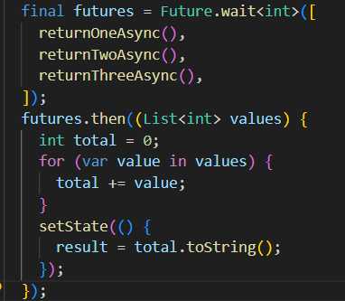

```text
Nama: Wahyudi
NIM: 2241720018
Kelas: 3C
```

---

# Tugas Pemrograman Mobile Jobsheet 9

## Praktikum 1: Mengunduh Data dari Web Service (API)

### Langkah 1: Menambahkan dependensi http


```text
Menambahkan dependensi http telah selesai.
```

## W12: Soal 1

### Langkah 2: Menambahkan kode pada main.dart


```text
Menambahkan nama panggilan Anda pada title app telah selesai.
```

## W12: Soal 2

### Langkah 3: Menambahkan method getData()


```text
Menambahkan url judul buku favorit telah selesai.
```

## W12: Soal 3

### Langkah 4: Menambahkan kode di ElevatedButton


```text
- substring: berfungsi untuk mengambil sebagian data dari respons HTTP yang diterima
- catchError: mengelola kemungkinan kesalahan yang terjadi saat permintaan data.
```

### Langkah 5: Run


```text
Menampilkan data JSON telah selesai.
```

## Praktikum 2: Menggunakan await/async untuk menghindari callbacks

### Langkah 1: Menambahkan 3 method class _FuturePageState


```text
Fungsi returnOneAsync, returnTwoAsync, dan returnThreeAsync menunggu selama 3 detik sebelum mengembalikan nilai integer (masing-masing 1, 2, dan 3).
```

### Langkah 2: Menambahkan method count()


```text
Fungsi count menjalankan tiga operasi asinkron secara berurutan, menunggu setiap fungsi selesai sebelum melanjutkan.
```

### Langkah 3: Memanggil count()


```text
Memanggil count() telah selesai.
```

## W12: Soal 4

### Langkah 4: Run


```text
Menampilkan angka 6 akan tampil setelah delay 9 detik.
```

## Praktikum 3: Menggunakan Completer di Future

### Langkah 1: Menambahkan variabel dan method


```text
Kode ini menggunakan Completer untuk mengelola operasi asinkron. Fungsi getNumber menginisialisasi Completer, memanggil fungsi calculate(), dan mengembalikan Future yang terkait dengan Completer. Fungsi calculate menunda eksekusi selama 5 detik, lalu menyelesaikan Completer dengan nilai 42, yang kemudian tersedia sebagai hasil Future dari getNumber.
```

### Langkah 2: Mengganti isi kode onPressed()


```text
Mengganti isi kode onPressed() telah selesai.
```

## W12: Soal 5

### Langkah 3: Run


```text
Menampilkan angka 42 akan tampil setelah delay 5 detik.
```

### Langkah 4: Mengganti method calculate()


```text
Mengganti method calculate() telah selesai.
```

### Langkah 5: Mengganti isi kode onPressed()


```text
Mengganti isi kode onPressed() telah selesai.
```

## W12: Soal 6

### Jelaskan maksud perbedaan kode langkah 1-2 dengan langkah 4-5 tersebut!

```text
- langkah 1-2 tidak menangani kesalahan, sehingga jika ada kesalahan dalam proses asinkron, aplikasi tidak akan memberikan respons khusus.
- langkah 4-5 menambahkan penanganan kesalahan dengan menggunakan try-catch dan completer.completeError, sehingga kesalahan bisa ditangani dan pengguna diberi tahu jika terjadi error.
```

### Langkah 7: Run


```text
Menampilkan angka 42 akan tampil setelah delay 5 detik.
```

## Praktikum 4: Memanggil Future secara paralel

### Langkah 1: Mengganti isi file main.dart


```text
Mengganti isi file main.dart telah selesai.
```

### Langkah 2: Mengganti isi kode onPressed()


```text
Mengganti isi kode onPressed() telah selesai.
```

## W12: Soal 7

### Langkah 3: Run


```text
Menampilkan angka 6 akan tampil setelah delay 3 detik.
```

### Langkah 4: Mengganti variabel futureGroup



```text
Mengganti variabel futureGroup telah selesai.
```

## W12: Soal 8

### Jelaskan maksud perbedaan kode langkah 1 dan 4!

```text
Langkah 1 menggunakan FutureGroup untuk mengelola Future secara manual, sementara langkah 4 menggunakan Future.wait, metode bawaan Dart yang lebih sederhana untuk menunggu dan mengumpulkan hasil dari beberapa Future secara bersamaan.
```

## Praktikum 5: Menangani Respon Error pada Async Code

### Langkah 1: Mengganti isi file main.dart


```text
Mengganti isi file main.dart telah selesai.
```

### Langkah 2: Mengganti isi kode onPressed()


```text
Mengganti isi kode onPressed() telah selesai.
```

## W12: Soal 9

### Langkah 3: Run


```text
Menampilkan Exception.
```

### Langkah 4: Menambahkan method handleError()


```text
Menambahkan method handleError() telah selesai.
```

## W12: Soal 10

### Panggil method handleError() tersebut di ElevatedButton, lalu run. Apa hasilnya?


```text
Menampilkan Exception.
```

### Jelaskan perbedaan kode langkah 1 dan 4!

```text
returnError adalah method yang melemparkan exception setelah penundaan, sementara handleError mencoba menjalankan returnError, menangkap exception jika terjadi, dan mengelola error tersebut dengan memperbarui tampilan serta menjalankan blok finally untuk mencetak pesan bahwa proses telah selesai.
```

## Praktikum 6: Menggunakan Future dengan StatefulWidget

### Langkah 1: Menginstall plugin geolocator


```text
Menginstall plugin geolocator telah selesai.
```

### Langkah 2: Menambahkan permission GPS


```text
Menambahkan permission GPS telah selesai.
```

## W12: Soal 11

### Langkah 3:  Membuat file geolocation.dart


```text
Membuat file geolocation.dart dengan menambahkan nama panggilan telah selesai.
```

### Langkah 4: Menambahkan LocationScreen()


```text
Menambahkan LocationScreen() telah selesai.
```

### Langkah 5:  Run


```text
Menampilkan latitude dan longititude telah selesai.
```

### Langkah 6:  Menambahkan animasi loading


```text
Menambahkan animasi loading telah selesai.
```

## W12: Soal 12

### Apakah Anda mendapatkan koordinat GPS ketika run di browser? Mengapa demikian?


```text
Ya, Aplikasi Flutter dapat memperoleh koordinat GPS di browser jika browser mendukung HTML5 Geolocation API. Dengan izin pengguna, browser dapat mengakses lokasi perangkat menggunakan Wi-Fi, IP, atau sensor perangkat, meskipun tidak selalu berdasarkan GPS langsung.
```

## Praktikum 7: Manajemen Future dengan FutureBuilder

### Langkah 1: Modifikasi method getPosition()


```text
Modifikasi method getPosition() telah selesai.
```

### Langkah 2: Menambahkan variabel


```text
Menambahkan variabel telah selesai.
```

### Langkah 3: Menambahkan initState()


```text
Menambahkan initState() telah selesai.
```

### Langkah 4: Mengedit method build()


```text
Mengedit method build() telah selesai.
```

## W12: Soal 13

### Apakah ada perbedaan UI dengan praktikum sebelumnya? Mengapa demikian?


```text
Tidak, tidak ada perbedaan UI dengan praktikum sebelumnya. UI yang digunakan tetap mengikuti struktur dasar yang sama
```

### Langkah 5: Menambahkan handling error


```text
Menambahkan handling error telah selesai.
```

## W12: Soal 14

### Apakah ada perbedaan UI dengan praktikum sebelumnya? Mengapa demikian?


```text
Ya, ada perbedaan UI dengan praktikum sebelumnya. Penambahan penanganan error menggunakan snapshot.hasError memungkinkan aplikasi menampilkan pesan kesalahan jika terjadi masalah dalam pengambilan data lokasi.
```

## Praktikum 8: Navigation route dengan Future Function

## W12: Soal 15

### Langkah 1:  Membuat file baru navigation_first.dart


```text
Membuat file baru navigation_first.dart dan menambahkan nama serta mengganti warna tema favorit pada title telah selesai.
```

### Langkah 2:  Menambahkan method di class _NavigationFirstState


```text
Menambahkan method di class _NavigationFirstState telah selesai.
```

### Langkah 3:  Membuat class NavigationSecond dengan StatefulWidget


```text
Membuat class NavigationSecond dengan StatefulWidget telah selesai.
```

### Langkah 4: Mengedit main


```text
Mengedit main telah selesai.
```

## W12: Soal 16

### Langkah 5: Run


```text
Menampilkan navigation first screen dan navigation second screen, Ketika tombol "Change Color" ditekan, akan ada 3 pilihan warna latar belakang.
```

## Praktikum 9: Memanfaatkan async/await dengan Widget Dialog

### Langkah 1:  Membuat file baru navigation_dialog.dart


```text
Membuat file baru navigation_dialog.dart dan menambahkan nama serta mengganti warna tema favorit pada title telah selesai.
```

### Langkah 2:  Menambahkan method async


```text
Menambahkan method async telah selesai.
```

### Langkah 3: Mengedit main


```text
Mengedit main telah selesai.
```

## W12: Soal 17

### Langkah 4: Run


```text
Menampilkan navigation dialog dan navigation, Ketika tombol "Change Color" ditekan, akan ada 3 pilihan warna latar belakang.
```